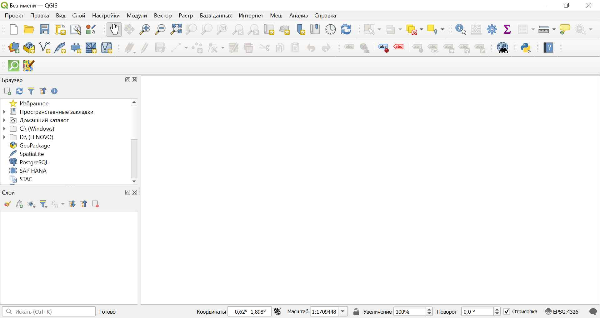
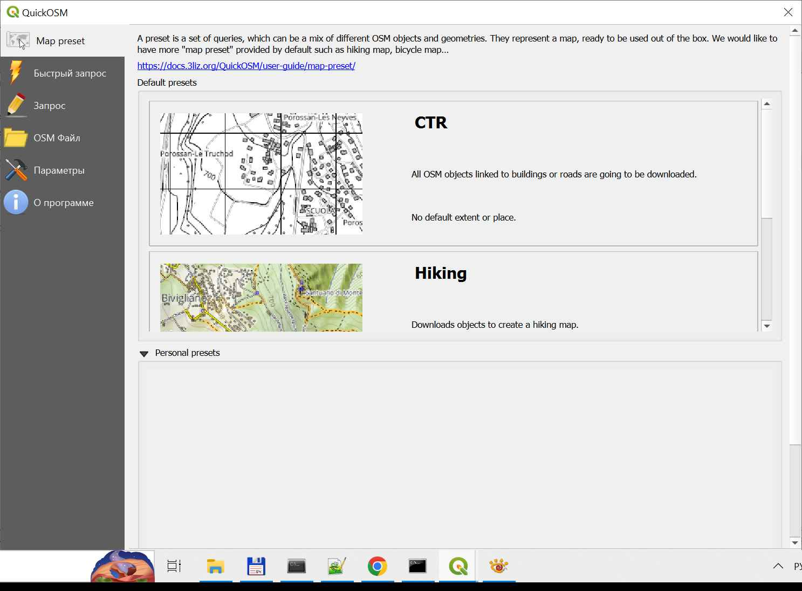
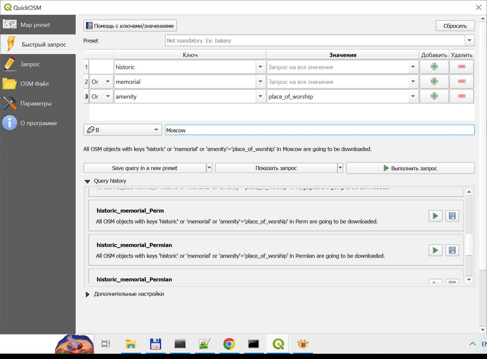
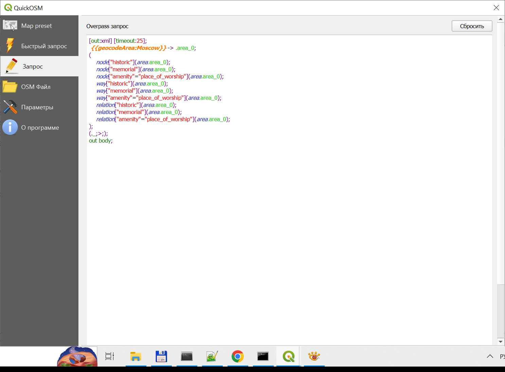
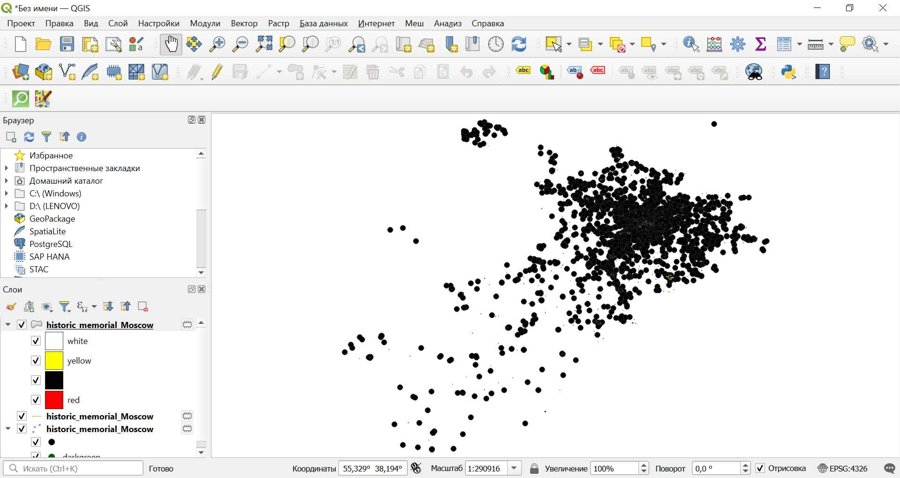
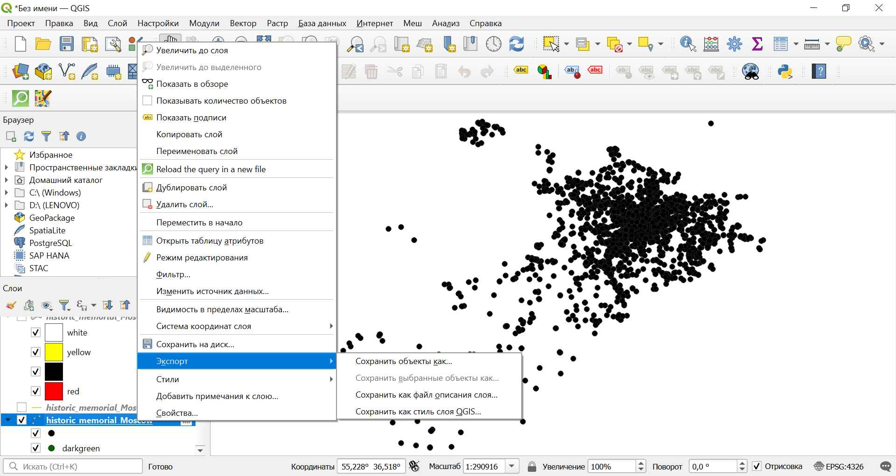
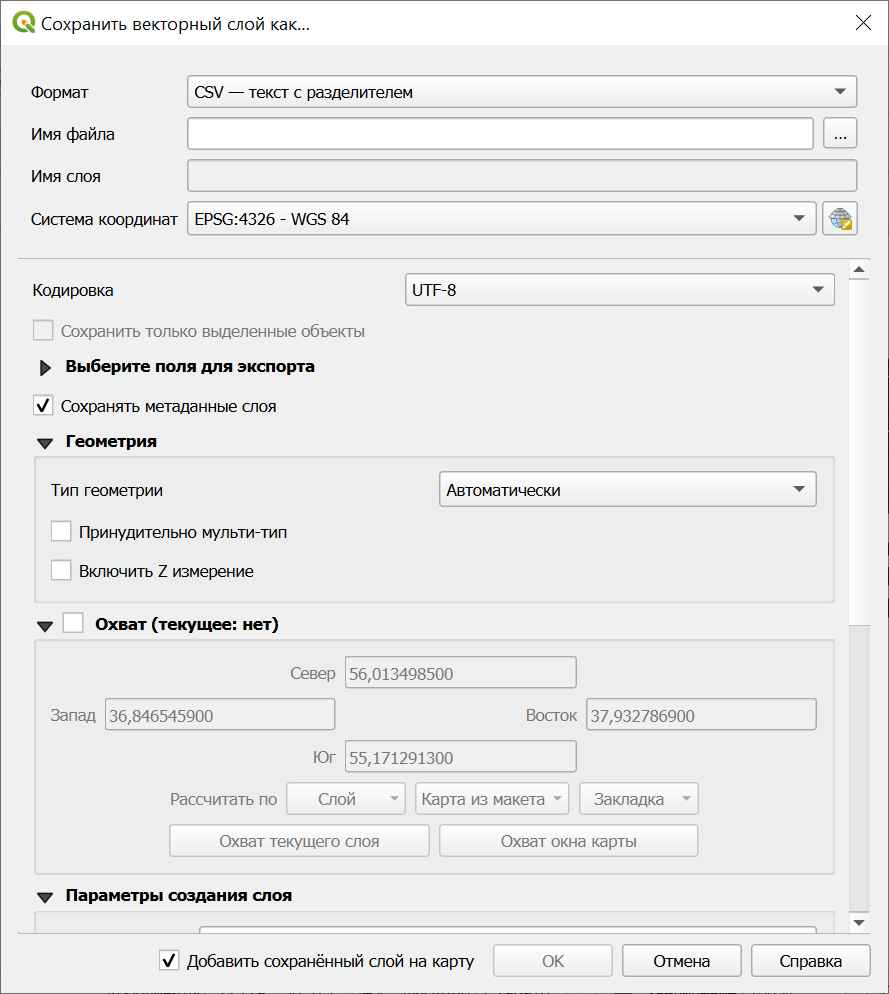
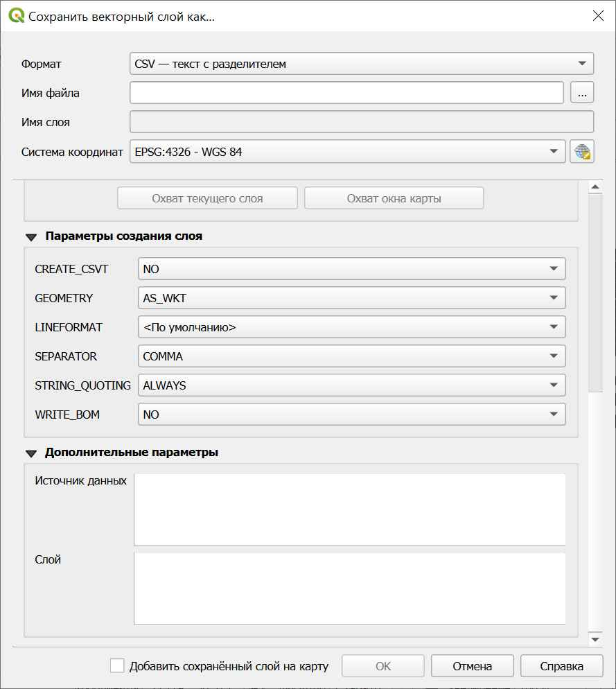

# Инструкция по загрузке базы достопримечательностей города

1. Загрузить и установить приложение [QGIS][qgis].
1. Загрузить и установить плагин [QuickOSM][quick-osm].
1. Открыть установленное приложение QGIS.

   

1. Запустить плагин QuickOSM.

   

1. Выбрать пункт меню "Быстрый запрос".

1. Выбрать список необходимых ключей в таблице (определяют тип
   достопримечательностей для загрузки) и город.
   
   

   Примечание: если нажать кнопку "Показать запрос", то будет
   показан сформированный запрос.

   

1. Нажать на кнопку "Выполнить запрос". В результате будет
   загружены слои на карте, содержащие доступные достопримечательности.

   

1. Экспортировать достопримечательности, отмеченные точками на карте,
   выбрав соответствующий пункт меню

   
   
   и установив необходимые параметры сохранения ("Имя файла" в формате
   csv, "Кодировка", "GEOMETRY", "SEPARATOR", "STRING_QUOTING").
   
   
   
   

<!-- LINKS -->
[qgis]: https://qgis.org/download
[quick-osm]: https://plugins.qgis.org/plugins/QuickOSM
